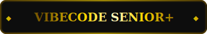

<div align="center">
  
</div>

<div align="center">
  
</div>

<br/>

<div align="center">
  <a href="https://t.me/unrealveliky">
    
  </a>
  &nbsp;
  <a href="mailto:deci.leet@gmail.com">
    
  </a>
  &nbsp;
  <a href="https://github.com/Deci1337">
    
  </a>
</div>

<br/>

<div align="center">
  
</div>

<br/>

---

## 🧠 About Me

```python
class Arseniy:
    name      = "Arseniy"
    alias     = "Deci1337"
    motto     = "Be patient and everything will come."
    focus     = ["AI Agents", "Automation", "Hackathons"]
    languages = ["Python", "C#", "C++", "JavaScript", "Lua", "HTML", "XAML", "XML"]
    tools     = ["n8n", "RAG", "OpenAI", "Claude", "YandexGPT", "GigaChat", "MAUI", "Docker", "React", "Node.js"]
    interests = ["AI for Business", "Process Automation", "Applied ML"]
```

> 🌹 *Ambitious people make my feelings better*

---

## 🛠️ Tech Stack

<div align="center">

**Languages**


**Frameworks & Tools**


**AI Models & APIs**


**Databases**


</div>

---

## 🤖 AI & Automation Projects

### ⏰ AI, Automation

<table>
  <tr>
    <td width="33%">
      <h3 align="center">📧 AI Email Assistant</h3>
      <p align="center">
        AI assistant for processing and generating business correspondence.<br/><br/>
        <a href="https://t.me/unrealveliky/61">
          
        </a>
      </p>
    </td>
    <td width="33%">
      <h3 align="center">💰 Finance AI Assistant</h3>
      <p align="center">
        Cross-platform financial AI assistant.<br/><br/>
        <a href="https://t.me/unrealveliky/62">
          
        </a>
      </p>
    </td>
    <td width="33%">
      <h3 align="center">🔍 Smart Search (Moscow Supplier Portal)</h3>
      <p align="center">
        AI-powered smart search for the Moscow Supplier Portal.<br/><br/>
        <a href="https://t.me/unrealveliky/90">
          
        </a>
      </p>
    </td>
  </tr>
</table>

### 💼 AI Agents for Business

<table>
  <tr>
    <td width="50%">
      <h3 align="center">🛒 AI Agent — Online Shop Automation</h3>
      <p align="center">
        Full automation of an online store powered by an AI agent.<br/><br/>
        <a href="https://t.me/unrealveliky/93">
          
        </a>
      </p>
    </td>
    <td width="50%">
      <h3 align="center">🎧 Tech Support Agent + RAG</h3>
      <p align="center">
        AI support agent with a knowledge base (RAG).<br/><br/>
        <a href="https://t.me/unrealveliky/95">
          
        </a>
      </p>
    </td>
  </tr>
  <tr>
    <td width="50%">
      <h3 align="center">🎵 TikTok AI Agent</h3>
      <p align="center">
        AI agent for automating TikTok workflows.<br/><br/>
        
      </p>
    </td>
    <td width="50%">
      <h3 align="center">📢 Telegram Moderator + News Posting Agent</h3>
      <p align="center">
        AI moderator bot and automated news posting agent for Telegram.<br/><br/>
        
      </p>
    </td>
  </tr>
</table>

### 👾 Other Projects

<table>
  <tr>
    <td width="33%">
      <h3 align="center">🏫 Family School Website</h3>
      <p align="center">
        Website for a family-run school.<br/><br/>
        
      </p>
    </td>
    <td width="33%">
      <h3 align="center">🎮 Skin Changer (Reverse Eng.)</h3>
      <p align="center">
        Skin changer built via reverse engineering.<br/><br/>
        <a href="https://t.me/unrealveliky/74">
          
        </a>
      </p>
    </td>
    <td width="33%">
      <h3 align="center">🔐 Offline Encrypted Messenger</h3>
      <p align="center">
        Messenger with encryption, relay and voice/video calls.<br/><br/>
        <a href="https://t.me/unrealveliky/84">
          
        </a>
      </p>
    </td>
  </tr>
</table>

---

## 📊 GitHub Stats

<div align="center">
  
</div>

<div align="center">
  
</div>

---

## 🏅 Achievements

<div align="center">
  
</div>

---

## 📈 Activity Graph

<div align="center">
  
</div>

---

<div align="center">
  
</div>
